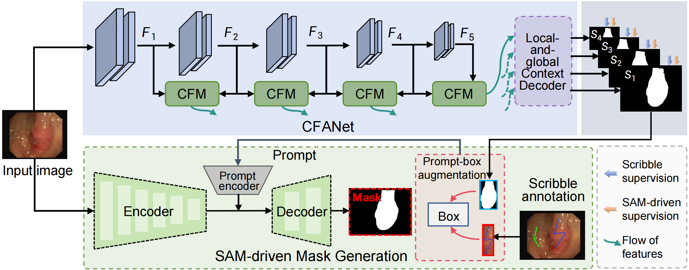
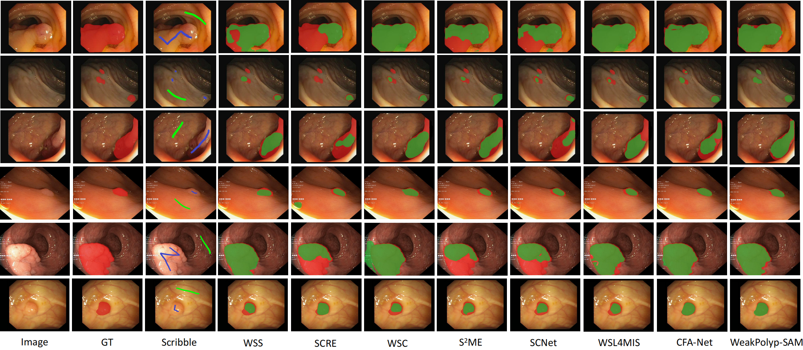

# WeakPolyp-SAM: Segment Anything Model-driven Weakly-supervised Polyp Segmentation

> **Authors:**
>
> [*Yiming Zhao*](),
> [*Tao Zhou*](https://taozh2017.github.io),
> [*Yunqi Gu*](),
> [*Yi Zhou*](https://cs.seu.edu.cn/yizhou/main.htm),
> [*Yizhe Zhang*](https://yizhezhang.com/),
> [*Ye Wu*](https://dryewu.github.io/),
> and [*Huazhu Fu*](https://hzfu.github.io/).
>

## 1. Preface

- This repository provides code for "_**WeakPolyp-SAM: Segment Anything Model-driven Weakly-supervised Polyp Segmentation**_" 

## 2. Overview

### 2.1. Framework Overview

<p align="center">
     <br />
    <em>
    Figure 1: Overview of the proposed framework. 
    </em>
</p>


### 2.3. Qualitative Results

<p align="center">
     <br />
    <em> 
    Figure 2: Visualization results of different methods on the polyp segmentation.
    </em>
</p>

## 3. Method

1. Installation

   To set up the environment and install dependencies, run:

    ```bash
    pip install -r requirements.txt
    ```

2. Data:

    + downloading Polyp dataset, which can be found from [GoogleDrive](https://drive.google.com/drive/u/1/folders/1yd-3sSuBlp8uux40wZ8mWM_WU2WDE-m7?dmr=1&ec=wgc-drive-hero-goto), run:
    ```bash
    unrar x PolypData.rar
    ```
    + downloading SAM weights and move it into `./checkpoints/sam_vit_b_01ec64.pth`,
    which can be found from [GitHub](https://github.com/facebookresearch/segment-anything?tab=readme-ov-file#model-checkpoints).

3. Preprocessing:

    + Download PolypData and put them into `./data` folder with the following structure:
       ```
       |-- data
       |   |-- TrainDB
       |       |-- image
       |       |-- scribble
       |   |-- TestDB
       |       |-- CVC-300
       |       |-- CVC-ClinicDB
       |       |-- CVC-ColonDB
       |       |-- ETIS-LaribPolypDB
       |       |-- Kvasir
       ```
    + Download the pre-trained model.

4. Training:
    
    + To train our model, run:
    ```bash
    python train_semi_SAM.py
    ```
5. Testing:

    + To test our model, just run:
    ```bash
    python test.py
    ```

## 4. License

The source code and dataset are free for research and education use only. Any comercial use should get formal permission first.

---

**[⬆ back to top](#1-preface)**
