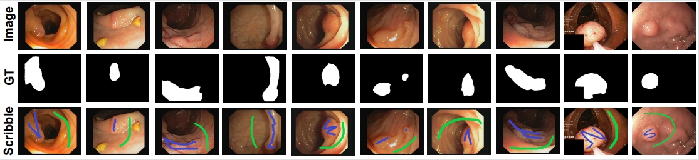

# WeakPolyp-SAM

- This repository will provide the code for "WeakPolyp-SAM: Segment Anything Model-driven Weakly-supervised Polyp Segmentation"

      
    <em> 
    Figure 1: Some examples of colonoscopy images with scribble annotations
    </em>

